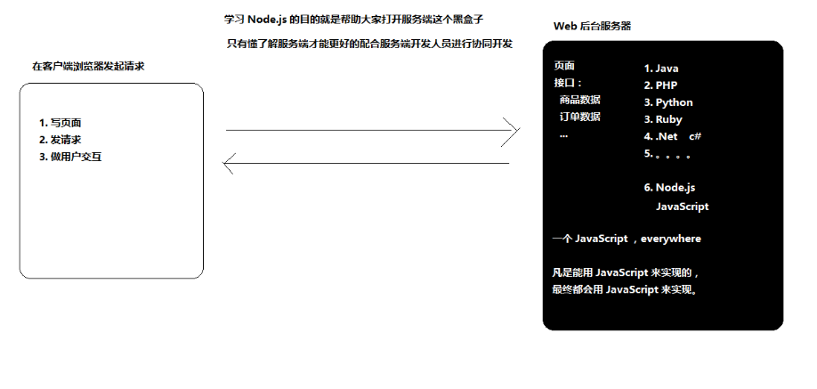
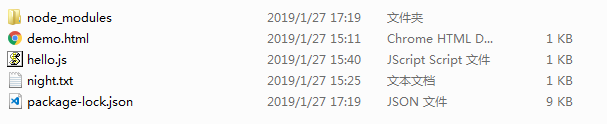
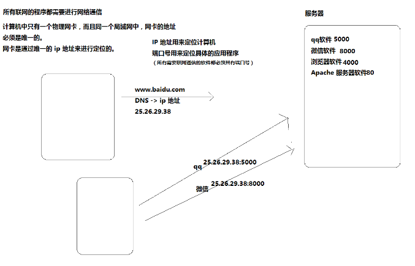

[TOC]

# Node.js

## 第一天	Node.js基础

### 1. Node.js是什么？



- Node.js 是JavaScript的运行时环境，类似浏览器与JavaScript的关系
- Node.js既不是语言，也不是框架，他是一个平台。
- Node.js中的JavaScript
  - 没有BOM和DOM
  - 只有EcmaScript
  - 在Node中为JavaScript提供了一些服务器级别的API
    - 文件操作的能力
    - http服务的能力等等。

### 2. Node.js环境的安装

- 很简单一直点击next就行。

### 3. Node执行JavaScript脚本文件

1. 定义一个js文件，内容为`console.log('hello world');`



2. 在命令行窗口当中运行`node hello.js`

```
C:\Users\Administrator\Desktop\node>node hello.js
hello world
C:\Users\Administrator\Desktop\node>
```

### 4. Node操作文件

> **注意：浏览器中的 JavaScript是没有文件操作的能力的，但是Node中的JavaScript具有文件操作的能力**
>
> **fs 是file-syetem的简写，就是文件系统的意思，在Node中如果想要进行文件的操作，就必须引入fs这个核心的模块**
>
> **在fs这个核心的模块当中，就听过了所有文件操作相关的API**
>
> 例如：
>
> ```
> fs.readFile//就是读取文件的操作
> fs.writeFile//就是写入文件的操作	
> ```

```
// 1. 使用 require 方法加载 fs 核心模块
var fs = require('fs')

// 2. 读取文件
//    第一个参数就是要读取的文件路径
//    第二个参数是一个回调函数
//          
//        成功
//          data 数据
//          error null
//        失败
//          data undefined没有数据
//          error 错误对象
fs.readFile('./data/a.txt', function (error, data) {
  // <Buffer 68 65 6c 6c 6f 20 6e 6f 64 65 6a 73 0d 0a>
  // 文件中存储的其实都是二进制数据 0 1
  // 这里为什么看到的不是 0 和 1 呢？原因是二进制转为 16 进制了
  // 但是无论是二进制01还是16进制，人类都不认识
  // 所以我们可以通过 toString 方法把其转为我们能认识的字符
  // console.log(data)

  // console.log(error)
  // console.log(data)

  // 在这里就可以通过判断 error 来确认是否有错误发生
  if (error) {
    console.log('读取文件失败了')
  } else {
    console.log(data.toString())
  }
})
================================================================================
var fs = require('fs')

// $.ajax({
//   ...
//   success: function (data) {
    
//   }
// })

// 第一个参数：文件路径
// 第二个参数：文件内容
// 第三个参数：回调函数
//    error
//    
//    成功：
//      文件写入成功
//      error 是 null
//    失败：
//      文件写入失败
//      error 就是错误对象
fs.writeFile('./data/你好.md', '大家好，给大家介绍一下，我是Node.js', function (error) {
  // console.log('文件写入成功')
  // console.log(error)
  if (error) {
    console.log('写入失败')
  } else {
    console.log('写入成功了')
  }
})
```

### 5. Node构建http服务器

```
// 接下来，我们要干一件使用 Node 很有成就感的一件事儿
// 你可以使用 Node 非常轻松的构建一个 Web 服务器
// 在 Node 中专门提供了一个核心模块：http
// http 这个模块的职责就是帮你创建编写服务器的

// 1. 加载 http 核心模块
var http = require('http')

// 2. 使用 http.createServer() 方法创建一个 Web 服务器
//    返回一个 Server 实例
var server = http.createServer()

// 3. 服务器要干嘛？
//    提供服务：对 数据的服务
//    发请求
//    接收请求
//    处理请求
//    给个反馈（发送响应）
//    注册 request 请求事件
//    当客户端请求过来，就会自动触发服务器的 request 请求事件，然后执行第二个参数：回调处理函数
server.on('request', function () {
  console.log('收到客户端的请求了')
})

// 4. 绑定端口号，启动服务器
server.listen(3000, function () {
  console.log('服务器启动成功了，可以通过 http://127.0.0.1:3000/ 来进行访问')
})
```

> 注意：`request事件当中的回调函数当中有两个参数request与response,他们是两个对象。`

```
var http = require('http')

var server = http.createServer()

// request 请求事件处理函数，需要接收两个参数：
//    Request 请求对象
//        请求对象可以用来获取客户端的一些请求信息，例如请求路径
//    Response 响应对象
//        响应对象可以用来给客户端发送响应消息
server.on('request', function (request, response) {
  // http://127.0.0.1:3000/ /
  // http://127.0.0.1:3000/a /a
  // http://127.0.0.1:3000/foo/b /foo/b
  console.log('收到客户端的请求了，请求路径是：' + request.url)

  // response 对象有一个方法：write 可以用来给客户端发送响应数据
  // write 可以使用多次，但是最后一定要使用 end 来结束响应，否则客户端会一直等待
  response.write('hello')
  response.write(' nodejs')

  // 告诉客户端，我的话说完了，你可以呈递给用户了
  response.end()

  // 由于现在我们的服务器的能力还非常的弱，无论是什么请求，都只能响应 hello nodejs
  // 思考：
  //  我希望当请求不同的路径的时候响应不同的结果
  //  例如：
  //  / index
  //  /login 登陆
  //  /register 注册
  //  /haha 哈哈哈
})

server.listen(3000, function () {
  console.log('服务器启动成功了，可以通过 http://127.0.0.1:3000/ 来进行访问')
})
```

> **接下来,让http服务器智能一点,可以通过传入的url,来响应不同的页面**

```
var http = require('http')

// 1. 创建 Server
var server = http.createServer()

// 2. 监听 request 请求事件，设置请求处理函数
server.on('request', function (req, res) {
  console.log('收到请求了，请求路径是：' + req.url)
  console.log('请求我的客户端的地址是：', req.socket.remoteAddress, req.socket.remotePort)

  // res.write('hello')
  // res.write(' world')
  // res.end()

  // 上面的方式比较麻烦，推荐使用更简单的方式，直接 end 的同时发送响应数据
  // res.end('hello nodejs')

  // 根据不同的请求路径发送不同的响应结果
  // 1. 获取请求路径
  //    req.url 获取到的是端口号之后的那一部分路径
  //    也就是说所有的 url 都是以 / 开头的
  // 2. 判断路径处理响应

  var url = req.url

  if (url === '/') {
    res.end('index page')
  } else if (url === '/login') {
    res.end('login page')
  } else if (url === '/products') {
    var products = [{
        name: '苹果 X',
        price: 8888
      },
      {
        name: '菠萝 X',
        price: 5000
      },
      {
        name: '小辣椒 X',
        price: 1999
      }
    ]

    // 响应内容只能是二进制数据或者字符串
    //  数字
    //  对象
    //  数组
    //  布尔值
    res.end(JSON.stringify(products))
  } else {
    res.end('404 Not Found.')
  }
})

// 3. 绑定端口号，启动服务
server.listen(3000, function () {
  console.log('服务器启动成功，可以访问了。。。')
})
```

### 6. NodeJs当中的模块化

> require 是一个方法
> 它的作用就是用来加载模块的
> 在 Node 中，模块有三种：
>    **具名的核心模块，例如 fs、http**
>    **用户自己编写的文件模块**
>      *相对路径必须加 ./*
>      *可以省略后缀名*
>      *相对路径中的 ./ 不能省略，否则报错*
>    **在 Node 中，没有全局作用域，只有模块作用域**
>      *外部访问不到内部*
>      *内部也访问不到外部*
>      默认都是封闭的
>    既然是模块作用域，那如何让模块与模块之间进行通信
>    有时候，我们加载文件模块的目的不是为了简简单单的执行里面的代码，更重要是为了使用里面的某个成员

> 首先,定义两个文件a.js 和 b.js

```
***a.js文件***
// require 方法有两个作用：
//    1. 加载文件模块并执行里面的代码
//    2. 拿到被加载文件模块导出的接口对象
//    
//    在每个文件模块中都提供了一个对象：exports
//    exports 默认是一个空对象
//    你要做的就是把所有需要被外部访问的成员挂载到这个 exports 对象中
var bExports = require('./b')
var fs = require('fs')

console.log(bExports.foo)

console.log(bExports.add(10, 30))

console.log(bExports.age)

bExports.readFile('./a.js')

fs.readFile('./a.js', function (err, data) {
  if (err) {
    console.log('读取文件失败')
  } else {
    console.log(data.toString())
  }
})
```

```
***b.js文件***
var foo = 'bbb'

// console.log(exports)

exports.foo = 'hello'

exports.add = function (x, y) {
  return x + y
}

exports.readFile = function (path, callback) {
  console.log('文件路径：', path)
}

var age = 18

exports.age = age

function add(x, y) {
  return x - y
}

```

### 7. IP地址与端口号



> **注意：IP地址定位的是计算机**
>
> ​	**端口号定位的是计算机中的应用程序**
>
> ​	**任何需要联网的程序都需要绑定一个端口号进行通信**

```
// ip 地址用来定位计算机
// 端口号用来定位具体的应用程序
// 所有需要联网通信的应用程序都会占用一个端口号

var http = require('http')

var server = http.createServer()

// 2. 监听 request 请求事件，设置请求处理函数
server.on('request', function (req, res) {
  console.log('收到请求了，请求路径是：' + req.url)
  console.log('请求我的客户端的地址是：', req.socket.remoteAddress, req.socket.remotePort)

  res.end('hello nodejs')
})

server.listen(5000, function () {
  console.log('服务器启动成功，可以访问了。。。')
})

```

### 8. Http服务器中的Content-Type

> `response.setHeader('Content-Type', 'text/plain; charset=utf-8')`
>
> **用来规定响应头部的类型，以及编码格式**

```
var http = require('http')

var server = http.createServer()

server.on('request', function (req, res) {
  // 在服务端默认发送的数据，其实是 utf8 编码的内容
  // 但是浏览器不知道你是 utf8 编码的内容
  // 浏览器在不知道服务器响应内容的编码的情况下会按照当前操作系统的默认编码去解析
  // 中文操作系统默认是 gbk
  // 解决方法就是正确的告诉浏览器我给你发送的内容是什么编码的
  // 在 http 协议中，Content-Type 就是用来告知对方我给你发送的数据内容是什么类型
  // res.setHeader('Content-Type', 'text/plain; charset=utf-8')
  // res.end('hello 世界')

  var url = req.url

  if (url === '/plain') {
    // text/plain 就是普通文本
    res.setHeader('Content-Type', 'text/plain; charset=utf-8')
    res.end('hello 世界')
  } else if (url === '/html') {
    // 如果你发送的是 html 格式的字符串，则也要告诉浏览器我给你发送是 text/html 格式的内容
    res.setHeader('Content-Type', 'text/html; charset=utf-8')
    res.end('<p>hello html <a href="">点我</a></p>')
  }
})

server.listen(3000, function () {
  console.log('Server is running...')
})
```

### 9. 组合使用fs与http两个API

> **在响应服务的时候肯定不能直接将页面以字符串的方式传递过来，一般是用`fs.readFile`将文件当中的信息读取出来，然后发送过来。**

```
// 1. 结合 fs 发送文件中的数据
// 2. Content-Type
//    http://tool.oschina.net/commons
//    不同的资源对应的 Content-Type 是不一样的
//    图片不需要指定编码
//    一般只为字符数据才指定编码

var http = require('http')
var fs = require('fs')

var server = http.createServer()

server.on('request', function (req, res) {
  // / index.html
  var url = req.url

  if (url === '/') {
    // 肯定不这么干
    // res.end('<!DOCTYPE html><html lang="en"><head><meta charset="UTF-8"><title>Document</title></head><body><h1>首页</h1></body>/html>')

    // 我们要发送的还是在文件中的内容
    fs.readFile('./resource/index.html', function (err, data) {
      if (err) {
        res.setHeader('Content-Type', 'text/plain; charset=utf-8')
        res.end('文件读取失败，请稍后重试！')
      } else {
        // data 默认是二进制数据，可以通过 .toString 转为咱们能识别的字符串
        // res.end() 支持两种数据类型，一种是二进制，一种是字符串
        res.setHeader('Content-Type', 'text/html; charset=utf-8')
        res.end(data)
      }
    })
  } else if (url === '/xiaoming') {
    // url：统一资源定位符
    // 一个 url 最终其实是要对应到一个资源的
    fs.readFile('./resource/ab2.jpg', function (err, data) {
      if (err) {
        res.setHeader('Content-Type', 'text/plain; charset=utf-8')
        res.end('文件读取失败，请稍后重试！')
      } else {
        // data 默认是二进制数据，可以通过 .toString 转为咱们能识别的字符串
        // res.end() 支持两种数据类型，一种是二进制，一种是字符串
        // 图片就不需要指定编码了，因为我们常说的编码一般指的是：字符编码
        res.setHeader('Content-Type', 'image/jpeg')
        res.end(data)
      }
    })
  }
})

```

